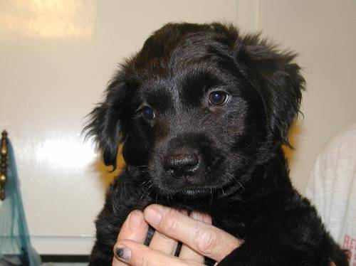

# Dog vs Cat Classifier
This is a dog &amp; cat classifying project

 - Data used is from https://www.kaggle.com/c/dogs-vs-cats/data

In this project, I builded four models: 
 - two customized CNN models with three conv-pool structured layers and an output section(one trained on augmented data and the other trained on raw data; both similar to the structure shown below)
 - VGG16 
 - MobileNetV2 

Due to computation resource limit, I apply VGG16 and MobileNetV2 with transfer learning. 

(Image URL: https://www.researchgate.net/figure/Illustration-of-typical-CNN-structure_fig3_332611193)

   

Example images from the training and testing set

As a result, the MobileNetV2 shows the fastest learning speed, with a final accuracy of around 0.985. The augmented customized CNN model had approximately same running time as VGG16, while the former achieves a highest accuracy of around 0.9, and the latter had an accuracy of around 0.98. It is clear that 1) data augmentation largely regularized the model. By comparison, the accuracy with and without data augmentation is around 0.8 and 0.9, a hugh difference. 2) in the cat-dog classifcation case, with our specified seed, both the running speed and the accuracy of MobileNetV2 outperforms VGG16. 
