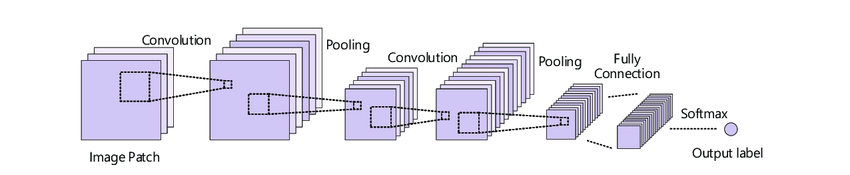
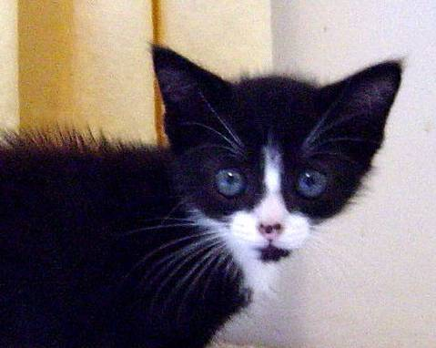

# Dog vs Cat Classifier
This is a dog &amp; cat classifying project

 - Data used is from https://www.kaggle.com/c/dogs-vs-cats/data

I will be using a customized CNN model and VGG16 and MobileNetV2 with transfer learning

              

